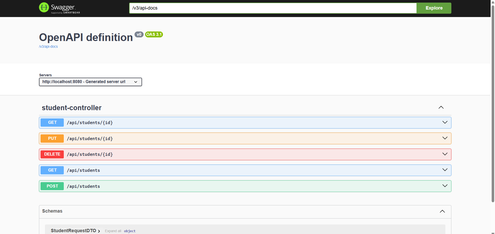

# Spring Boot, MySQL, DTO, Record, Mapper, API REST et Swagger

## Student API

API REST simple de gestion des étudiants développée avec **Spring Boot**, **MySQL**, **Spring Data JPA**, **DTO**, **Record**, **Mapper manuel** et **Swagger UI**.

## Objectif du projet

Ce projet permet de gérer des étudiants à travers une API REST.

Les fonctionnalités principales sont :

- ajouter un étudiant
- afficher tous les étudiants
- afficher un étudiant par identifiant
- modifier un étudiant
- supprimer un étudiant
- tester les endpoints avec Swagger UI

## Structure du projet

## 1er run 

## Accès à Swagger UI

## Test 1 — Ajouter un étudiant

## Test 2 — Afficher tous les étudiants

### GET /api/students

## Test 3 — Rechercher par identifiant
### GET /api/students/1

## Test 4 — Modifier l’étudiant

## Test 5 — Supprimer l’étudiant

## Test 6 — Vérifier la suppression

## Base de donnee apres suppression et ajout une autre fois 

